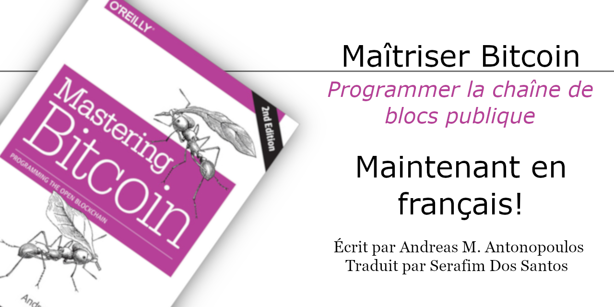

# Maîtriser Bitcoin : Programmer la cha&icirc;ne de blocs ouverte, 2ième Édition Ouverte

Le livre **Maîtriser Bitcoin : Programmer la chaîne de blocs ouverte** (_**Mastering Bitcoin: Programming the Open Blockchain**_ par O'Reilly Media) tel qu'écrit originalement en anglais par _Andreas M. Antonopoulos_, traduit en français (Canada) par _Google Translate API_ et révisé par _Serafim Dos Santos_ avec les termes du [Grand dictionnaire terminologique (GDT)](https://gdt.oqlf.gouv.qc.ca/) de l'[Office qu&eacute;b&eacute;cois de la langue fran&ccedil;aise](https://www.oqlf.gouv.qc.ca/).

---

---

<h2><em>Mastering Bitcoin - Second Edition</em></h2>
<blockquote> 

La source originale de ces textes est tiré du livre à édition ouverte <strong>Mastering Bitcoin</strong> par <em>Andreas M. Antonopoulos</em> accessible sur GitHub

👉 <a href="https://github.com/bitcoinbook/bitcoinbook">github.com/bitcoinbook/bitcoinbook</a> 👈

Ευχαριστώ Ανδρέα!
 
</blockquote>

<pre>

!!!!!!!!!!!!!!!!!!!!!!!!!!!!!!!!!!!!!!!!!!
!!!   CE PROJET EST EN DÉVELOPPEMENT   !!!
!!!!!!!!!!!!!!!!!!!!!!!!!!!!!!!!!!!!!!!!!!
</pre>

## Feuille de route
* Traduction
  - [ ] Phase de traduction (DONE1) : en cours...
  - [ ] Phase de révision (DONE2) : en attente...
  - [ ] Phase de conclusion (DONEF) : en attente...
* Révision
  - [ ] Phase de révision externe

<h1>Ma&icirc;triser Bitcoin</h1>
<h2>Programmer la cha&icirc;ne de blocs ouverte</h2>

Auteur : <strong>Andreas M. Antonopoulos</strong> 
Traducteur : <strong>Google Translate API</strong> 
Réviseur : <strong>Serafim Dos Santos</strong>

---
1. [Preface](DONE1/html/for_use_mastering-bitcoin_preface-open_fr_CA.html)
2. [Glossaire](DONE1/html/for_use_mastering-bitcoin_glossary-1_fr_CA.html)
3. [Chapitre 1 - Introduction](DONE1/html/for_use_mastering-bitcoin_chapter-1_fr_CA.html)
4. [Chapitre 2 - Comment fonctionne Bitcoin](DONE1/html/for_use_mastering-bitcoin_chapter-2_fr_CA.html)
5. [Chapitre 3 - Bitcoin Core: La référence d'implémentation](DONE1/html/for_use_mastering-bitcoin_chapter-3_fr_CA.html)
6. [Chapitre 4 - Clés et adresses](DONE1/html/for_use_mastering-bitcoin_chapter-4_fr_CA.html)
7. [Chapitre 5 - Portefeuilles](DONE1/html/for_use_mastering-bitcoin_chapter-5_fr_CA.html)
8. [Chapitre 6 - Opérations](DONE1/html/for_use_mastering-bitcoin_chapter-6_fr_CA.html)
9. [Chapitre 7 - Transactions et scripts avancés](DONE1/html/for_use_mastering-bitcoin_chapter-7_fr_CA.html)
10. Chapitre 8
11. Chapitre 9
12. Chapitre 10
13. Chapitre 11
14. Chapitre 12
15. Annexe A - Le livre blanc du Bitcoin de Satoshi Nakamoto
16. Annexe B - Script OPs
17. [Annexe C - Bitcoin Improvement Proposals (BIPs ou Propositions d’améliorations du Bitcoin)](DONE1/html/for_use_mastering-bitcoin_appendix-bips_fr_CA.html)
18. Annexe D - PyCoin
19. Annexe E - BX
20. Annexe F - BitCore

---
## Translations
If you are interested in translating this book, please join a team of volunteers at [www.transifex.com/bitcoinbook/mastering-bitcoin/](https://www.transifex.com/bitcoinbook/mastering-bitcoin/)
Free copies of "Mastering Bitcoin Open Edition", translated in many languages, can be downloaded from [bitcoinbook.info](https://bitcoinbook.info)

---
 Cette œuvre est mise à disposition selon les termes de la <a rel="license" href="http://creativecommons.org/licenses/by-sa/4.0/">Licence Creative Commons Attribution -  Partage dans les Mêmes Conditions 4.0 International</a>.
